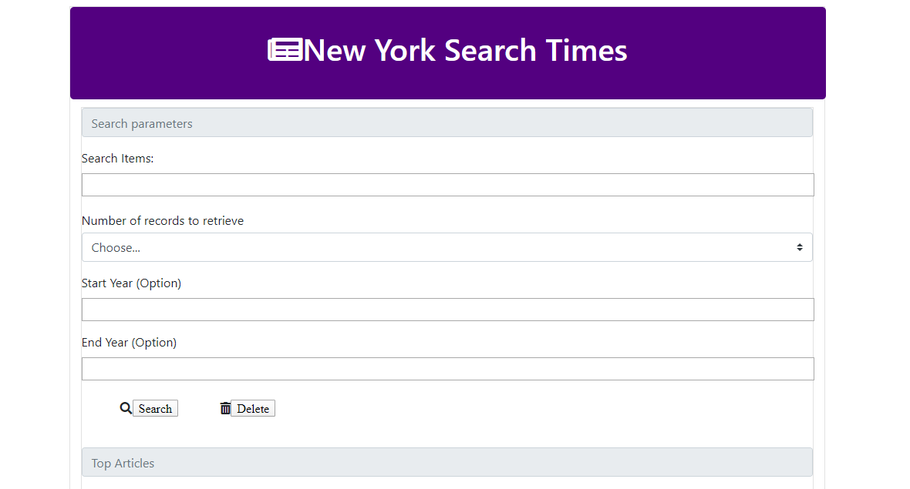

# KC-T1-NYTimes-Search

## Class Activity done with Keshav Avva and Asad Rauf

* Fully functioning search page utilizing:

    * the [API](http://developer.nytimes.com/article_search_v2.json).

### File List:

1. Index.html
    
    Main Page - Search

2. Script.js    
    
    Javascript for Main Page 

3. Style.css

    Stylesheet for all

### Search Page

